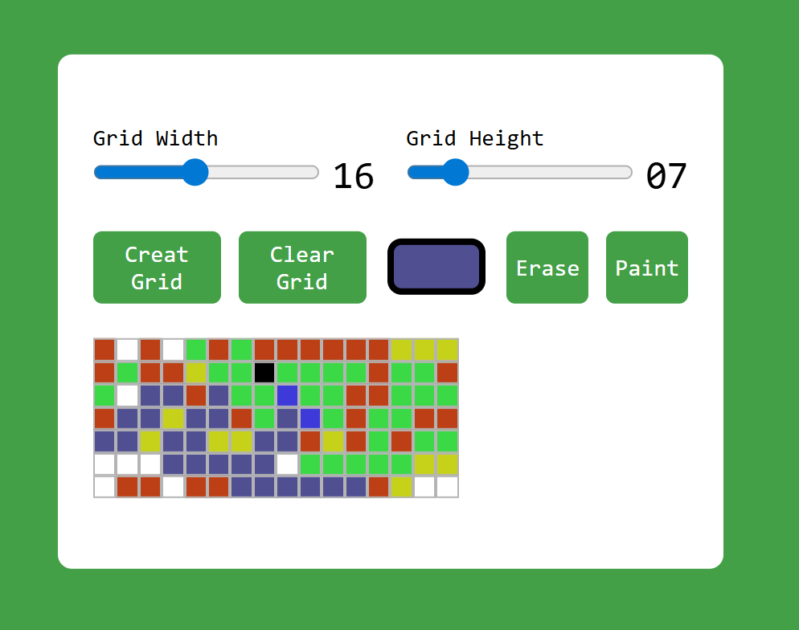

# Pixel Art Generator 🎨

A simple Pixel Art Generator built with HTML, CSS, and JavaScript.

Users can create customizable pixel grids and draw pixel art directly in the browser.

---

## Features

* Adjustable grid width and height
* Paint mode
* Erase mode
* Color picker
* Clear grid button
* Dynamic grid generation

---

## Technologies Used

* HTML5
* CSS3
* JavaScript (Vanilla JS)

---

## Preview



---

## How to Use

1. Select grid width and height
2. Click **Create Grid**
3. Choose a color
4. Start painting 🎨
5. Use **Erase** to remove colors
6. Use **Clear Grid** to reset the board

---

## Project Structure

```bash
├── index.html
├── style.css
├── script.js
└── image.png
```

---

## Future Improvements

* Download artwork as image
* Mobile support
* Multiple color palettes
* Fill tool
* Undo / Redo functionality

---

## Author

Hojat Bagheri
