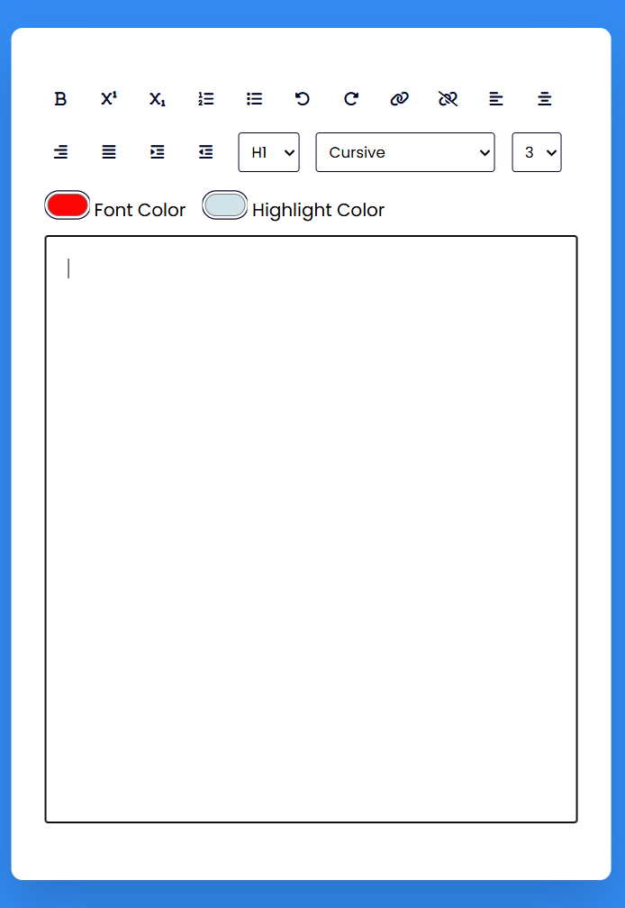

# Rich Text Editor 📝

A simple Rich Text Editor built with HTML, CSS, and JavaScript.

This project allows users to format text dynamically using browser editing features.

---

## Features

* Bold, italic, and underline formatting
* Text alignment controls
* Font family selection
* Font size selection
* Superscript and subscript support
* Text spacing options
* Create clickable links
* Active button highlighting
* Real-time text editing

---

## Technologies Used

* HTML5
* CSS3
* JavaScript (Vanilla JS)

---

## Preview



---

## How to Use

1. Type inside the editor area
2. Select text
3. Use toolbar buttons to apply formatting
4. Customize font family and size
5. Add links using the link button

---

## Project Structure

```bash
├── index.html
├── style.css
├── script.js
└── image.png
```

---

## JavaScript Concepts Practiced

* DOM Manipulation
* Event Listeners
* Arrays & Loops
* Dynamic Element Creation
* Text Formatting Commands
* Class Toggling
* Functions & Reusability

---

## Future Improvements

* Dark mode
* Save as PDF
* Undo / Redo functionality
* Custom color picker
* Export formatted text

---

## Author

Hojat Bagheri
