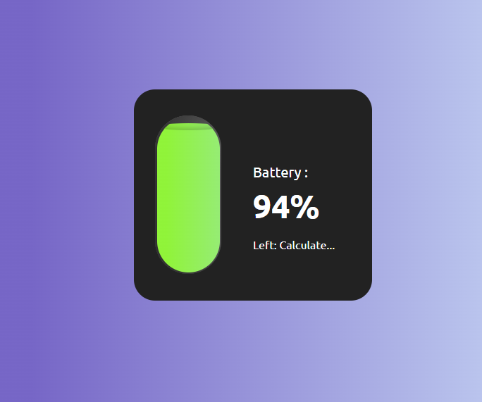

# 🔋 Battery Detector

A simple Battery Status application built with JavaScript and the Battery Status API.

## Features

- Display battery percentage
- Show charging / discharging status
- Show estimated charging time
- Show estimated remaining battery time
- Dynamic battery colors
- Charging animation
- Responsive UI

## Technologies

- HTML5
- CSS3
- JavaScript (ES6+)
- Battery Status API

## Preview



## Live Demo
https://battery-detector-web.netlify.app

## How It Works

The application uses:

```js
navigator.getBattery()
```

