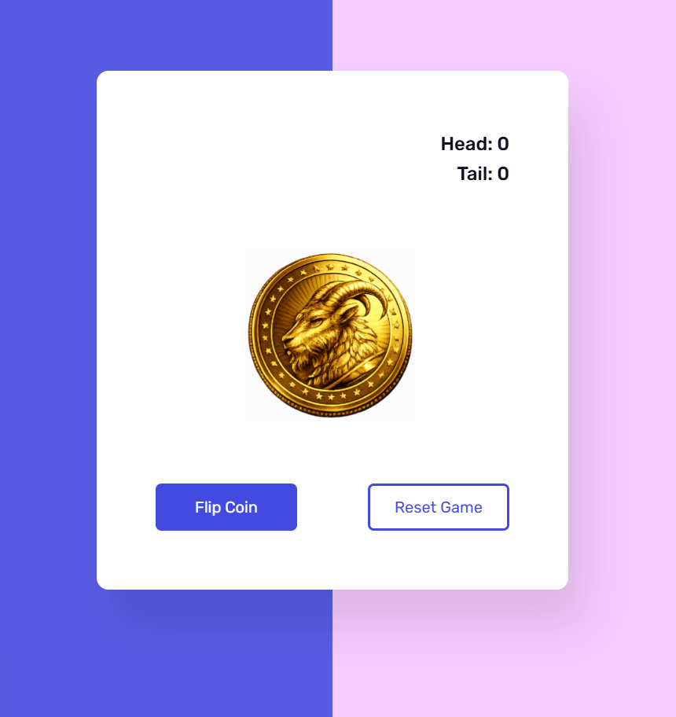

# Day 7 - Flip Coin Game

A simple **Flip Coin Game** built with **HTML, CSS, and JavaScript**. The application simulates a real coin toss using CSS 3D animations and randomly displays either **Heads** or **Tails** while keeping track of the results.

## Features

* Random coin flip using JavaScript
* Smooth 3D flip animation with CSS
* Heads and Tails counter
* Reset button to restart the game
* Prevents multiple clicks while the animation is running
* Responsive and clean user interface

## Technologies Used

* HTML5
* CSS3
* JavaScript (ES6)

## Concepts Practiced

* DOM Manipulation
* Event Listeners
* Random Number Generation (`Math.random()`)
* CSS Animations (`@keyframes`)
* 3D Transforms (`rotateX`, `preserve-3d`, `backface-visibility`)
* Timers (`setTimeout`)
* Button State Management (`disabled`)
* Animation Reset using `offsetWidth`

## How It Works

1. Click the **Flip Coin** button.
2. JavaScript generates a random value (0 or 1).
3. The previous animation is reset.
4. A Heads or Tails animation is played.
5. After the animation finishes, the corresponding counter is updated.
6. The flip button is disabled during the animation to prevent multiple clicks.
7. Press **Reset Game** to clear the score and reset the animation.


## Preview



## Project Structure

```text
Day7-FlipCoinGame/
│
├── index.html
├── style.css
├── script.js
├── head.png
├── tail.png
└── README.md
```

## Future Improvements

* Add flip sound effects
* Store scores using Local Storage
* Add dark/light mode
* Improve mobile responsiveness
* Display flip history

---

This project is part of my **100 Days of JavaScript** challenge, where I build one JavaScript project every day to strengthen my frontend development skills.
